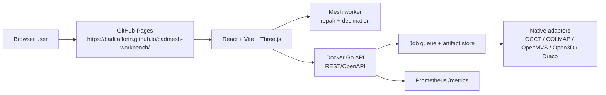

# cadmesh-workbench


Browser-first CAD, mesh repair, and photogrammetry-to-glTF workbench with a Docker compute API.

Live site: https://baditaflorin.github.io/cadmesh-workbench/

Repository: https://github.com/baditaflorin/cadmesh-workbench

Support: https://www.paypal.com/paypalme/florinbadita

Screenshot: https://raw.githubusercontent.com/baditaflorin/cadmesh-workbench/main/docs/screenshot.png

## What It Does

- Parametric CAD preview with backend job queuing for B-rep boolean workflows.
- Browser mesh repair and decimation worker with GLB export from the live Three.js scene.
- Photo upload flow that submits photogrammetry-to-glTF jobs to the Docker backend.
- Backend tool detection for OpenCascade/OCCT, COLMAP, OpenMVS, Open3D, and Draco adapters.
- Published Pages UI shows version and source commit in the top bar.

## Quickstart

```sh
npm install
make install-hooks
make dev
make test
make smoke
```

## Docker Backend

```sh
make docker-build
make compose-up
```

The production image name is `ghcr.io/baditaflorin/cadmesh-workbench`.

## Architecture



ADRs: https://github.com/baditaflorin/cadmesh-workbench/tree/main/docs/adr

API: https://github.com/baditaflorin/cadmesh-workbench/blob/main/api/openapi.yaml

Deploy guide: https://github.com/baditaflorin/cadmesh-workbench/blob/main/deploy/README.md

## Security

No secrets belong in the frontend or git history. Use `.env.example` and `deploy/.env.example` as templates, and run `make install-hooks` before committing.

## License

MIT
