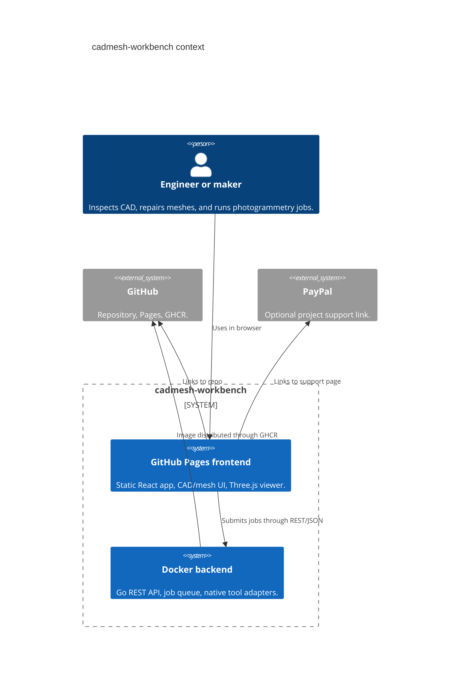
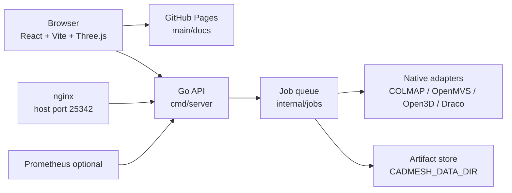

# Architecture

Live site: https://baditaflorin.github.io/cadmesh-workbench/

Repository: https://github.com/baditaflorin/cadmesh-workbench

## Context

## Containers

The GitHub Pages boundary is explicit: the backend never serves frontend assets, and the frontend never contains secrets.
